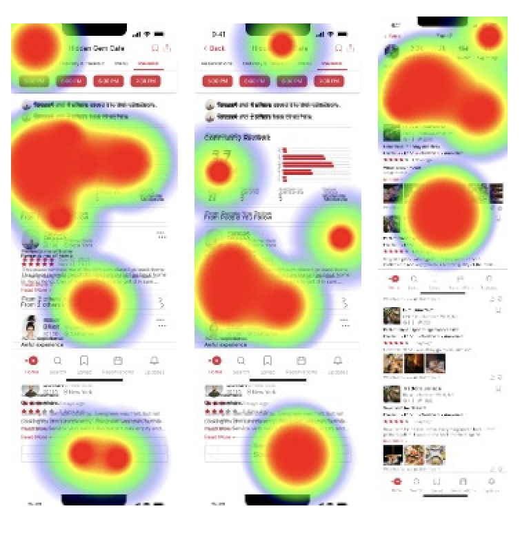

<figure markdown>
  { width="1000" }
</figure>
OpenTable, a popular online restaurant reservation platform, has accumulated millions of reviews, but despite its unique offering and competitive advantage, it has **failed to establish trust among diners regarding the authenticity and usefulness of these reviews**. This project aims to investigate the underlying reasons and redesigns its review system to **empower diners to make informed decisions on where to dine with confidence with the help of its community**.

- :material-clock: **Timeline** 5 weeks
- :material-lightbulb-on: **Roles** User Research, UI Design, Product Strategy
- :material-hand-clap: **Team** Luz from Memorisely
- :material-toolbox: **Tools** Figma, Maze

## 🧐 Problem Statement

OpenTable is a well-known platform for reserving restaurant seats, but how helpful is it for diners when it comes to making a decision about where to eat?

!!! success "When it works great"

    When someone already **knows exactly where they want to go**, OpenTable works great: search, book and all set!

!!! warning annotate "When it could be better"

    However, when diners are **uncertain about a restaurant or are searching for something new**, OpenTable is not usually regarded as the leading platform for reviews or guidance on where to dine.(1)

1. Qualitatively, there are sentiments expressed through articles like [this one](https://mikewchan.medium.com/opentable-vs-yelp-for-restaurant-reviews-what-i-learned-from-making-dinner-reservations-7ead57e7f684). Quantitatively, Yelp generally has more monthly visitors on the restaurant segment than OpenTable for its user-generated reviews.

### Lost Opportunities

OpenTable's main goal is to help diners make restaurant reservations. However, if its review system is not perceived as useful by users, it can lead to **a decrease in user engagement and missed booking opportunities**. Let's look at the following scenarios to help illustrate this point:

!!! failure "Lost to Yelp :material-information-outline:{ title="A social platform that connect people with local businesses, including restaurants. Compared to OpenTable, Yelp has invested in community building and reward system for reviews." } "
    { align=left width=8% }

    Alice is having trouble deciding on a dim sum restaurant she found on OpenTable with mixed reviews. She **turns to Yelp for more detailed reviews, specifically those written by Yelp Elites**:material-information-outline:{ title="Active community members recognized by Yelp for providing high-quality reviews." } . After seeing positive reviews from reviewers who frequent dim sum restaurants, she feels more assured in her decision and **books from Yelp**.

!!! failure "Lost to The Infatuation :material-information-outline:{ title="A curated blog that provides restaurant recommendations and reviews, similar to OpenTable, but with a focus on curated lists and a specific target audience." } "
    { align=left width="8%" }
    Bob is planning to make a reservation early on OpenTable for Valentine's Day and wants to find a restaurant that will impress his date. He **comes across a curated list of romantic restaurants in NYC on The Infatuation website**, written by an expert food editor and **calls the restaurant directly from there to make the reservation**.

!!! failure "Lost to TripAdvisor :material-information-outline:{ title="An online travel information and booking webiste for people to read reviews and get travel advices from community. " }"
    { align=left width="8%" }
    Cathy is traveling to NYC with her family for the first time and they have specific dietary restrictions which makes it difficult for her to find a restaurant. She **turns to TripAdvisor's forum to ask for specific recommendations from locals** and finds a great restaurant from a link shared by locals. She **books the restaurant via the link provided**.

*Jump to the [narrative rewrites] or their [new stories in action] with the new design.*
[user experience]: #user-experience
[narrative rewrites]: #rewrite-user-stories
[new stories in action]: #final-solution 

### Negative Perception

Besides a lack of trust in the **usefulness** of OpenTable's reviews, some diners are also skeptical of the **authenticity** and **fairness** of the system.

<figure markdown>
  
  <figcaption>Users' views from <a href="https://www.inside-las-vegas.com/1602/You-Cant-Trust-OpenTable-Reviews">a dedicated blog post</a> and <a href="https://www.sitejabber.com/reviews/opentable.com">a review site</a></figcaption>
</figure>

The missed opportunities for bookings and diners' poor perception of OpenTable are unfortunate, especially given the fact that **the platform has the competitive advantage of scale and the unique offering of verified diners on its reviews**.

<figure markdown>
  { width="1000" }
  <figcaption><a href="https://www.opentable/about">OpenTable</a> takes pride in its reviews.</figcaption>
</figure>

???+ information annotate "What differentiates OpenTable's reviews from others" 
	1. It is the only platform that **guarantees that all reviews are from actual diners** who have visited the restaurant. (2) 
	2. It typically **has more reviews** for a given restaurant compared to other platforms, yet many users seem to be unaware or surprised by this fact. (1)

1. :simple-medium: An [article](https://mikewchan.medium.com/opentable-vs-yelp-for-restaurant-reviews-what-i-learned-from-making-dinner-reservations-7ead57e7f684) on Medium by a diner highlights the surprise he experienced upon discovering that OpenTable has more reviews than Yelp for most restaurants.
2. :fontawesome-solid-ruler: See OpenTable's review [guidelines](https://help.opentable.com/s/article/Ratings-and-Reviews-1505261056054?language=en_US#Communitystandards).

What's happening here? There seems to be **a gap between how OpenTable positions its reviews and how diners perceive them**, and the gap is causing OpenTable **missed booking opportunities and hurting the brand's reputation**.

<figure markdown>
  { width="1000" }
</figure>

## 🔦 UX Research

### Competitor Benchmarking

To answer the question, we started the research by performing usability audits on OpenTable's review flow and comparing it with other platforms'.

By comparing OpenTable and TripAdvisor in depth and identifying pain points and wow moments for both platforms, we gained insights on the strengths and weaknesses of each platform. The exercise also gave us inpirations on how might we improve OpenTable's review system for better usability and customer delight.

<figure markdown>
  { width="1000" }
  <figcaption>Benchmarking against TripAdvisor </figcaption>
</figure>

However, we didn't want to lose sight of the main problem we set out to answer. By stepping back and focusing on the trust aspect specifically, and comparing across platforms, we saw clearly what is missing from OpenTable's review system.

<figure markdown>
  { width="1000" }
  <figcaption> OpenTable does not provide access to peer profiles. </figcaption>
</figure>

??? danger "Lack of credibility on user profile"

    - Lack of real photos.
    - Unclickable profiles.
    - Inconsistent format when displaying user information.

### Secondary Research

To confirm our belief that the absence of user profiles contributes to a lack of trust in reviews, we conducted research and gathered information from various sources. Many studies and papers stress the significance of identity building in fostering trust on online platforms, and these provided key insights on what we could focus on to reshape users' perceptions and experiences on OpenTable

???+ quote "Insights from external resources"

    === "Research paper"

    	By letting reviewers **add identity-descriptive information** (e.g., name, geographic location or profile picture) to their reviews, system designers can support reviewers in improving their trustworthiness and thus **increase the perceived helpfulness of their reviews** Another way of increasing the perceived helpfulness of reviews involves awarding badges or certificates to reputable reviewers [:link:](https://www.sciencedirect.com/science/article/pii/S0963868717302263)

    === "HBS Case Study on Yelp"

    	Design choices begin with deciding who can review and whose reviews to highlight.Consumer response to a restaurant’s average rating is **affected by the number of reviews and whether the reviewers are certified as “elite” by Yelp, but is unaffected by the size of the reviewers’ Yelp friends network**.[:link:](https://www.hbs.edu/ris/Publication%20Files/12-016_a7e4a5a2-03f9-490d-b093-8f951238dba2.pdf)

    	*See how we applied this insight on the [final design].*
    	[final design]:#what-information-should-we-display-on-a-diners-profile

    === "Airbnb Blog"

    	...customizing their profile and **building a basic identity** as a member of the community.Building your profile isn’t a task; it’s an opportunity. And it’s our job to highlight that opportunity for our community. [:link:](https://airbnb.design/designing-for-trust/)

### Key Insights

Diners who have the option to make reservations on OpenTable opt for alternative platforms for various reasons. Some are looking for expert recommendations, some want authentic voices and detailed information, and some prefer community-backed insights. However, **a common thread among them is the desire for reviews written by real people**. OpenTable's reviews are written by verified users, but they are not seen as relatable or friendly. **<mark>What is missing from OpenTable's reviews is the absence of personal identities and human connections associated with each review. </mark>** The good news is that the review system has the potential to include these attributes, it just needs to be redesigned to make the information easily accessible to users.

### Ideation

With more knowledge and insights, we then practiced divergent thinking with techniques such as Mind Mapping and Crazy 8's, followed by Priority Matrix to prioritize and narrow our focus.

!!! example "Ideation"

    === "Mind Mapping"
    	{ width="1000" }
    === "Crazy 8's"
    	{ width="1000" }
    === "Priority Matrix"
    	{ width="1000" }

### Rewrite User Stories

With a clear direction in mind, we envisioned how the changes could impact diners' experience, especially for those who [almost booked] with OpenTable. <mark>How might the new design change their booking experiences and behaviors?</mark>

[almost booked]: #lost-opportunities

!!! Success "Booked with assurance from the network."

    === "After"
        { align=left width=8% }
    	Alice finds the dim sum place on OpenTable. When browsing reviews, she notices five of her friends have bookmarked the place and three have left positive reviews. **Trusting her networks' taste, she books with confidence. She might even invite her friends she saw on the list to the table**.
    === "Before"
         { align=left width=8% }
    	Alice is having trouble deciding on a dim sum restaurant she found on OpenTable with mixed reviews. She **turns to Yelp for more detailed reviews, specifically those written by Yelp Elites**:material-information-outline:{ title="Active community members recognized by Yelp for providing high-quality reviews." } . After seeing positive reviews from reviewers who frequent dim sum restaurants, she feels more assured in her decision and **books from Yelp**.

!!! Success "Booked from favorite editors' pick"

	=== "After"
	    { align=left width="8%" }
		Bob opens OpenTable and sees the fresh Valentine's Day list curated by one of his favorite OpenTable editors - Tim. He has tried out a few restaurants recommended by Tim and they all exceeded his expectations. Bob browses through the list and **books one within minutes knowing Tim knows the best romantic places in NYC**.
	=== "Before"
	    { align=left width="8%" }
		Bob is planning to make a reservation early on OpenTable for Valentine's Day and wants to find a restaurant that will impress his date. He **comes across a curated list of romantic restaurants in NYC on The Infatuation website**, written by an expert food editor and **calls the restaurant directly from there to make the reservation**.

!!! Success "Booked from friends' collections"
	=== "After"
	    { align=left width="8%" }
		Cathy feels prepared for her trip to NYC. She follows diners with similar dietary restrictions on OpenTable and they have curated a list of restaurants they'd recommend locally. **Cathy reserves for a few restaurants from the list prior to her trip, and she plans to contribute to the list** as she discovers new places on her trip.
		
	=== "Before"
	    { align=left width="8%" }
		Cathy is traveling to NYC with her family for the first time and they have specific dietary restrictions which makes it difficult for her to find a restaurant. She **turns to TripAdvisor's forum to ask for specific recommendations from locals** and finds a great restaurant from a link shared by locals. She **books the restaurant via the link provided**.

### User flows

We then synthesized individual user stories to a universal user flow, which serves as a guideline for our next steps.

## 🛠️ UI Process

### Wireframe

<figure markdown>
  { align="right" width="1000" }
  <figcaption>wireframe</figcaption>
</figure>

### High Fidelity

_Click on images for lightbox effect. Navigate using :arrow_left: :arrow_right:._
=== "Initial Version"

	<figure markdown>
	{ align="right" width="1000" }
	<figcaption>See friends' review, visit their profile, see activities, discover new diners, get notified.</figcaption>
	</figure>

=== "Version after Usability Testing"
	
	<figure markdown>
	{ align="right" width="1000" }
	<figcaption>_V2 changed screens corresponding to V1. See all screens in the [final solution]._ </figcaption>
	</figure>
[final solution]: #final-solution
=== "Exisiting"
	<figure markdown>
	{ align="right" width="1000" }
	<figcaption>Existing OpenTable workflow, the profiles are inaccessible.</figcaption>
	</figure>
_Jump to [final solution]._
[final solution]: #final-solution

### Usability Testing

We tested out initial prototype using [Maze](https://maze.co/) and the feedback was valuable. Usability testing helped us identify our blind spots and prompted us to redesign the first two screens for better usability. In addition to asking users to complete various tasks, we also took a step back and inquired about their general preferences. The insights we gained helped us make adjustments and influenced the final design.

=== "Testing Screen HeatMap"

	<figure markdown>
	{ width="2000" }
	</figure>  
=== "Insight one"
	<figure markdown>
	{ width="2000" }
	</figure>

=== "Insight two"

	<figure markdown>
	{ align="right" width="2000" }
	</figure>

!!! success "What went well" 

	- User found the reviews informative, packed with valuable data.
	- The navigation to and from a diner's profile has high usability score.
!!! failure "What needs attention and iteration" 

	- The screen appears to be cluttered, which makes it difficult to find important information. 
	- The screen where users could see friends' reviews have poor usability scores.
!!! note "What we learned" 
	- Diners would prefer seeing others' collection rather than activities and timeline. 
	- In hindsight, we could have asked questions through survey or user interviews prior to hi-fi design.

### Arriving at final solution

Throughout the design process, sometimes, we developed multiple alternatives for each feature. The following examples showcase a few of them and detail our decision-making process in selecting the final solution.

#### How should we surface reviews from friends on the reviews page?

=== "The final solution"

	<figure markdown>
	{ width="2000" }
	</figure>  
=== "The alternative"
	<figure markdown>
	{ width="2000" }
	</figure>

??? question "What are the constraints and considerations?"
     Introducing "view friends' reviews" to the existing "view all reviews" will lead to great discoverability of the feature. However, that also means great risks. 
     The goal is to introduce the new functionality without interrupting the existing workflow and to give users the control over what they'd prefer to see.
    
	- [x] Are friends' reviews prominent and accessible from the main page?
	- [x] Can diners opt out from viewing friends' reviews?
	- [x] For a restaurant without friends' reviews, how might we make the current system more helpful?
??? abstract "Why did we choose the final solution?"
	An alternative solution that blends into the existing review section, while seemingly attractive, actually complicates the review ranking and causes confusion for users upon first glance. Additionally, it doesn't provide the option for diners to opt out of seeing friends' reviews first. 
	
	A better approach would be to separate out friends' reviews on the main page and then combine them on the review page using a filter. This leads to **improved discoverability, minimal interruption and easy navigation between friends' and all reviews**. Additionally, when the user closes the review section, it sends a clear signal of their preferences, allowing for more **personalized review pages**.

****

#### What information should we display on a diners' profile?

=== "The final solution"

	<figure markdown>
	{ width="1000" }
	</figure>  
=== "The alternative with different content"
	<figure markdown>
	{ width="1000" }
	</figure>
=== "The alternative with different format"
	<figure markdown>
	{ width="1000" }
	</figure>

??? question "What are the constraints and considerations?"
     Although the redesign aims to focus on building diner profiles and fostering a sense of community on OpenTable, it is important to note that **OpenTable is not a social media platform**. The goal is to display information about reviewers that is relevant and useful when viewing their reviews.
     
	- [x] What information can effectively convey the identity of a diner as a reviewer?
	- [x] What information would be beneficial for other diners to establish trust in this reviewer?
	- [x] How can we prioritize important information while still displaying other relevant details?
??? abstract "Why did we choose the final solution?"
    We chose to remove the `following` and `followers` numbers from diner profiles as [research] has shown that these numbers do not affect how diners view a restaurant. Instead, we opted to display `upvotes` to **show the diner's contributions to the community**. We also added `avg ratings` to **provide a benchmark for the ratings given in reviews, as ratings can be subjective**. 
    
    In terms of format, we chose the final version as it **aligns with user profile norms on other platforms and allows for more organized display of information**.
  [research]: #__tabbed_1_2

## ✨ Final Solution

Remember those [diners who have previously] turned to the alternative platforms? 
With the new review features on OpenTable, they now can benefit from reviews and make their booking on the platform with confidence. 

_Click on images for lightbox effect. Navigate using :arrow_left: :arrow_right:._

[diners who have previously]: #lost-opportunities

	
??? Tip "Filter out noises and read reviews from who you follow."
	{ align="left" width="8%"" }
	Follow Alice as she uses the new feature to uncover hidden gems. She checks what's popular among friends from home page, reviews her networks' engagement with the restaurant, filters reviews by those written by people she follows, and looks at the most upvoted community reviews to make decision with confidence.

 

{ align="right" width="2000" }

=== "`Popular in your network` on home page"
	<figure markdown>
	{ width="2000" }
	</figure>  
=== "Restaurant home page"
	<figure markdown>
	{ width="2000" }
	</figure>

=== "List of people you follow who has collected the restaurant"

	<figure markdown>
	{ align="right" width="2000" }
	</figure>
=== "Rating and reviews by people you follow on review page"

	<figure markdown>
	{ align="right" width="2000" }
	</figure>
=== "Reviews sorted by usefulness on review page"

	<figure markdown>
	{ align="right" width="500" }
	</figure>

	
??? Tip "Follow OpenTable editors and stay up to date on the best spots in town."

	{ align=left width=8% }
	Follow Bob as he discovers a new OpenTable editor while browsing his friends' activity feed. He is impressed by the editor's extensive range of restaurant reviews and subscribes to their profile for updated recommendations. Thanks to this editor, Bob snags the hottest spot in town for Valentine's Day. 

 

{ align="right" width="2000" }

=== "Friend's activity feeds"
	<figure markdown>
	{ width="2000" }
	</figure>  
=== "OpenTable editor's profile"
	<figure markdown>
	{ width="2000" }
	</figure>

=== "Blog post"

	<figure markdown>
	{ align="right" width="2000" }
	</figure>
=== "`From Editors` in home page"

	<figure markdown>
	{ align="right" width="2000" }
	</figure>
=== "News notification"

	<figure markdown>
	{ align="right" width="500" }
	</figure>

	
??? tip "Connect with others through food and get inspiration from their wisdom"
	{ align=left width=5% }		
	Follow Cathy as she discovers a new vegan diner Teresa based in NYC, where she will travel to in a few days. She's delighted to find a list of vegan restaurants in Teresa's collection on OpenTable. She carefully goes through the list, checking the ratings, reviews, and pictures of the restaurants, makes a few reservations and bookmarks a few for later.

  	

{ align="right" width="2000" }

=== "Diner's profile"
	<figure markdown>
	{ width="2000" }
	</figure>

=== "Diner's collections"

	<figure markdown>
	{ align="right" width="2000" }
	</figure>
=== "Restaurants in Collections"

	<figure markdown>
	{ align="right" width="2000" }
	</figure>
=== "Bookmarks restaurants"

	<figure markdown>
	{ align="right" width="500" }
	</figure>

## 📏 Success Metrics

With the prototype ready, next step would be to bring the product to life, ship the product to a small percentage of users and iterate from there. If we were to ship the feature, we would have the following key metrics to help us measure success.

### Product perspective

???+ Question "How usable and useful is the feature?"

    === "Task Success Rate and Completion Time"
    	- View other diners' rating and comments on a restaurant.
    	- Book reservation from diner profiles, collections and recommendations.
    	- Manage diner profiles, reviews and restaurant collections.
    	- Search, discover and connect with other diners.
    	- Collaborate on collections.
    === "Feature Adoption"
        - Number of diners adopting each feature.
        - Time for diners to adopt each feature.
    === "Feature Engagement"
        -  Frequency of use with each feature.
        -  Duration of use with each feature.

### Business perspective

???+ Example "How does the feature adoption affect the business?"

	=== "User acquisition"
		- Are adopted diners invite more people to the platform? 
		- How long does it take for new users to build their network?
	=== "Revenue" 
		- Are adopted diners making more reservations? 
		- Are adopted diners booking tables with more seats?
	=== "Customer Satisfaction" 
		- Net Promoter Score
		- Customer lifetime value

### Long term visions

???+ tip "What does success mean in the long run?"
	If we see positive results with the release, it opens up discussion on new product lines and business opportunities in the future, led by the community. For example, we can envision creating diner-generated promotional content for restaurants, or organizing social dining experiences that are open to the community.

## 💡 Key Learnings

???+ note "Answer why before how"

    Direction matters more than efforts. Understanding the problem and questioning its root cause helped us to frame the problem in a productive way. Throughout the project, **our understanding of trust shifted from simply avoiding scams to closing the gap between the nature of the product and users' perception**. By delving deeper and asking why, we redefined the problem statement and were able to make meaningful progress from there.

???+ note "Design experiences before pixels"

    Focusing only on aesthetics can lead to creating a visually appealing design that lacks practicality and usefulness. By crafting relatable user narratives, **we were reminded of the desired outcome rather than output and that kept us on track.** In retrospect, we wish we had crafted user stories before diving into prototypes, as it would have helped us identify the most useful features for our users.

???+ note "Iterate, learn, repeat"

    There is never a perfect solution, but iteration and testing could get us closer to where we want to go. **Testing our prototypes with real users has challenged our assumptions and taught us ways to improve our design**. The most valuable takeway we learned from this experience is to iterate early and often, apply the learnings and never stop iterating.
