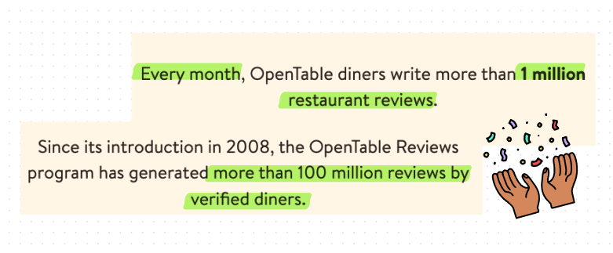

---
hide:
  - navigation
---
# Bring trust to OpenTable's reviews

<figure markdown>
  { width="1000" }
  <figcaption>Image caption</figcaption>
</figure>

- :fontawesome-brands-html5: __Timeline__ 5 weeks
- :fontawesome-brands-js: __My role__ designer
- :fontawesome-brands-css3: __Tools__ Figma
- :fontawesome-brands-internet-explorer: __Goal__ ... huh?

## Problem Statement

> There's a lack of credibility and trust in [OpenTable][opentable]'s review system. We want to bring trust into ratings and reviews. 

## Understand the problem

Given the problem statement :material-information-outline:{ title="The problem prompt was given to students for learing by Memorisely." }, we still think it's useful to do research to back the statement with data and gather insights to answer the following questions: 

  [opentable]: https://www.opentable.com/  "an online restaurant reservation service to book tables, view menus, and read reviews"

- [What is the current state of the review system?](#what-is-the-current-state-of-the-review-system)
- [Why is the problem worth solving?](#why-is-the-problem-worth-solving)
-  How can we come up with a solution that would be meaningful to the business?
-  How will we measure success?

### What is the current state of the review system?
#### How does the review system work?
According to OpenTable's guidelines, its review system requires users to have a reservation at a restaurant in order to leave a review. 
<figure markdown>
  
  <figcaption>From OpenTable's <a href="https://help.opentable.com/s/article/Ratings-and-Reviews-1505261056054?language=en_US#A3">guideline</a></figcaption>
</figure>

🟢 only diners can leave review  
🟢 all reviews (positive or negative) will be published  
That sounds promising from platform's perspective, and...

#### What's the diners' perceptions?

<figure markdown>
  
  <figcaption>Users' views from <a href="https://www.inside-las-vegas.com/1602/You-Cant-Trust-OpenTable-Reviews">a dedicated blog post</a> and <a href="https://www.sitejabber.com/reviews/opentable.com">a review site</a></figcaption>
</figure>

From the diners' perspective:  
🤨  they are skeptical of who's behind the reviews. 
😡  restaurants can leave "fake" reviews by registering as a diner.  

### Why is the problem worth solving?

#### Scale
OpenTable generates millions of reviews every month and takes pride in the fact that the reviews are all from verified users. An improvement on reviews would elevate millons' booking and dining experiences and shape their relationships with OpenTable. 

<figure markdown>
  { width="1000" }
  <figcaption>Opentable's About Page </figcaption>
</figure>

#### Impact
Trust and fairness on reviews is crucial to OpenTable retaining and acquiring users ( both diners and restaurants). Paying attention and investing in trust in reviews also aligns with OpenTable's mission:

>helping restaurants of **all sizes** thrive, to enabling diners to **find and book the perfect table for every occasion**, our story is one of **human connection—among diners and restaurants, and between restaurants and their communities**.

Trust and fairness are the cornerstones of genuine and meaningful relationships. 

<figure markdown>
  { width="1000" }
  <figcaption>diner's experience</figcaption>
</figure>

#### Consequences of inaction
- Users will leave the platform for competitors for insights and reviews.
- Smaller restaurant would opt for other platform for fairness. 

![[user_experience.png]]

## User Research
### Usability Testing

### Competitor Analysis

What gives Opentable edge is its review system powered by direct customer input. The review system serves a few parties:
1. Customers use reviews to make informed decisions about which restaurants to visit next.
2. Restaurants gain insights and constructive feedback on how to improve their system from the data.
3. The platform leverage the data insights to promote and rank restaurants that are highly rated - kicking off a healthy and organic competition in the marketplace. 
### What 
In this redesign project, we are focusing on making the reviews more trustworthy for the diners. By improving the review system, customers will make better decisions and feel good about their decisions. It will create a product stickiness. With network effect, Opentable will gain organic traction of new users and anticipate growth in bookings and revenues. 

## Audience
Diners who has the intent to find the best restaurant with specific occasion, budget, location in mind. 

characteristics

age, gender, location, occupation, mobility

different group -> different needs 

## User stories

- As a friend hosting dinner, i want to make sure to reserve a restaurant that will provide top notch hospitality
- As a , I want to have the best steak so that it will make my birthday memorable
- As a , i want best atomesphere and ambience so that it will make the date night go smoothly

## List ideas
what company could build to fulfill the customers' needs

Build X for {who, step2}, that {when and where, step 3} to {why, step 1}

## prioritize and choose an idea

impact / effort 

Reach
Value for customer
Potential revenue
implemntation effort

## solve

wireframe flows, user journeys, a list of ideas, sketches 

### storyboarding 
draw out users journey

uber order
request a car - wait for uber to find a car - check eta - leave the app - driver notify arrived - check car platte and find the car - identify each other - commute - leave

### defining tasks
CRUD
create, read, update, delete
### speady sketching

one minute sketching for 4 ideas/ crazy 4s, crazy 8s

### measure success
how do we know we are successful?

defining metrics/ kpis

task success rate, task completion time, engagemnt, retention, revenue, conversion, user aquisition, NPS 

ideas

minor changes
Overall rating
Food 
Service
Ambiance
Noise

keywords

- show number of ppl found the review helpful
	- show upvotes/ downvotes
- show % of ppl would come back again 
- show more information about the reviewer
	- dined here 3x in the past 6 months

https://www.sciencedirect.com/science/article/pii/S0963868717302263

> By letting reviewers add identity-descriptive information (e.g., name, geographic location or profile picture) to their reviews, system designers can support reviewers in improving their trustworthiness and thus increase the perceived helpfulness of their reviews ([Forman et al., 2008](https://www.sciencedirect.com/science/article/pii/S0963868717302263#b0225), [Karimi and Wang, 2017](https://www.sciencedirect.com/science/article/pii/S0963868717302263#b0360)) [Review Presentation]. Another way of increasing the perceived helpfulness of reviews involves awarding badges or certificates to reputable reviewers ([Kuan et al., 2015](https://www.sciencedirect.com/science/article/pii/S0963868717302263#b0390), [Chang and Wu, 2014](https://www.sciencedirect.com/science/article/pii/S0963868717302263#b0095), [Chang et al., 2013](https://www.sciencedirect.com/science/article/pii/S0963868717302263#b0100)) [Reviewer Reputation].

when i get on OpenTable and decide if I want to eat somewhere 