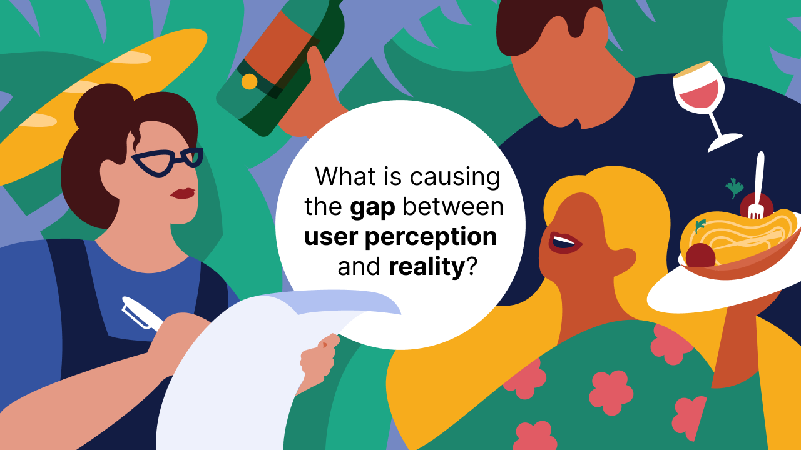
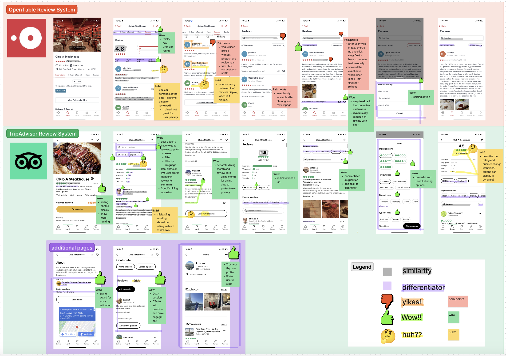
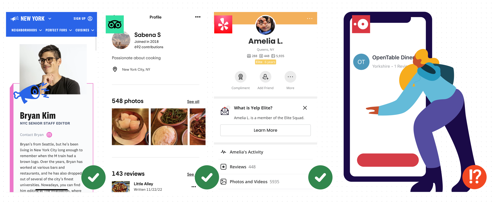
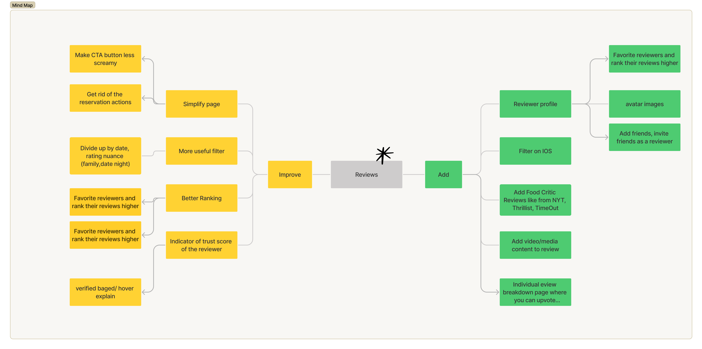
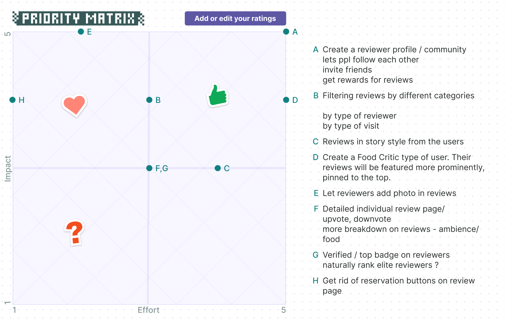
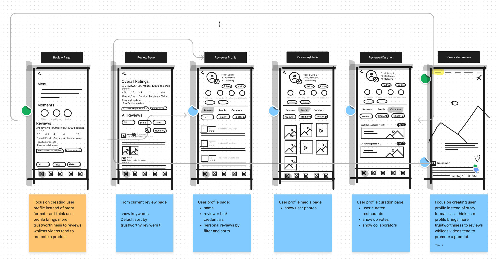
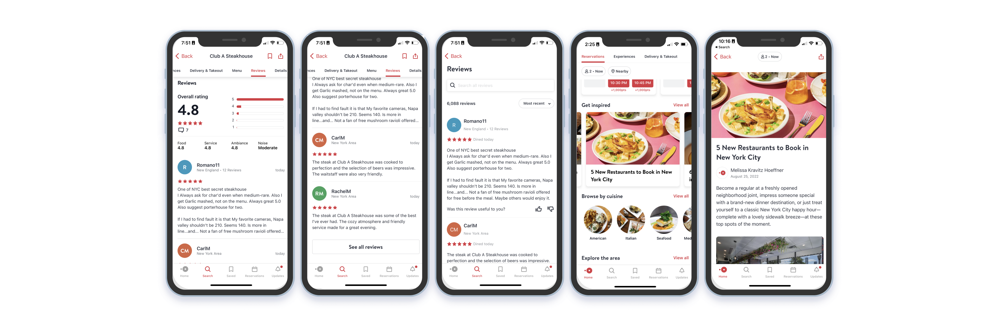
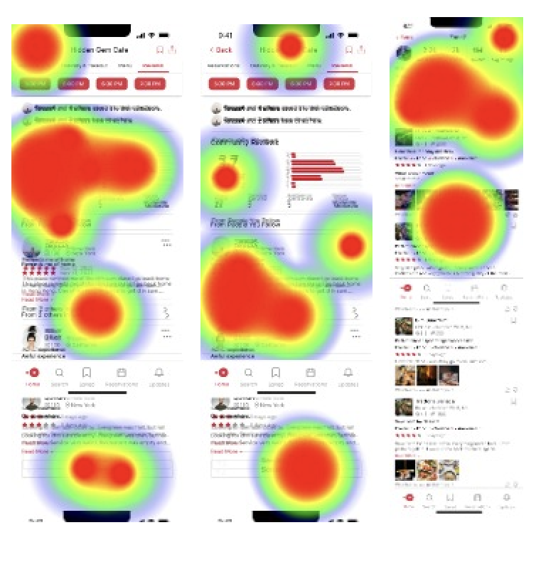
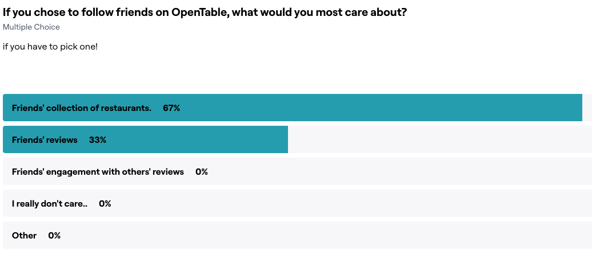
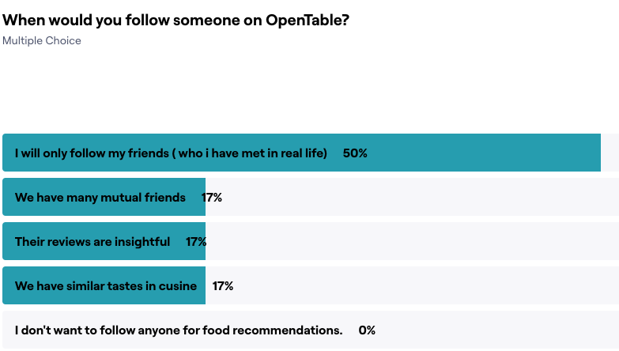

OpenTable, a popular online restaurant reservation platform, has amassed millions of reviews but **has failed to gain diners' trust in their informativeness and authenticity**. This project examines the root cause and redesigns the review system to empower diners **make quicker and better dining decisions**.

- :material-clock: **Timeline** 5 weeks
- :material-lightbulb-on: **Roles** User Research, UI Design.
- :material-hand-clap: **Team** Luz from Memorisely
- :material-toolbox: **Tools** Figma, Maze, FigJam

<figure markdown>
  { width="1000" }
  <figcaption>Image caption</figcaption>
</figure>

## 🧐 Problem Statement

OpenTable is a popular online restaurant reservation platform. How does it help you if you are want to book a reservation?

!!! success "When it works"

    When you **know exactly where to eat**, OpenTable works pretty well: search, book and you are all set.

!!! warning "When it doesn't help"

    However, when you are still **on the fence about a place or are in search of something new**, does OpenTable come first in mind for decision or inspiration?

### Lost Opportunities

OpenTable's main goal is to help diners make restaurant reservations. However, if its review system is not seen as beneficial by users, it negatively affects user engagement and results in **lost opportunities for bookings**. 

{ align=left width=10% }

!!! failure "Lost to Yelp :material-information-outline:{ title="A social platform that connect people with local businesses, including restaurants. Compared to OpenTable, Yelp has invested in community building and reward system for reviews." } "

    Alice is having trouble deciding on a dim sum restaurant she found on OpenTable reading mixed reviews. She **turns to Yelp for more detailed reviews, specifically those written by Yelp Elites**:material-information-outline:{ title="Active community members recognized by Yelp for providing high-quality reviews." } . After seeing positive reviews from reviewers who frequent dim sum restaurants, she feels more assured in her decision and **books from Yelp**.

{ align=right width="10%" }
!!! failure "Lost to The Infatuation :material-information-outline:{ title="A curated blog that provides restaurant recommendations and reviews, similar to OpenTable, but with a focus on curated lists and a specific target audience." } "

    Bob is planning to make a reservation early on OpenTable for Valentine's Day and wants to find a restaurant that will impress his date. He **comes across a curated list of romantic restaurants in NYC on The Infatuation website**, written by an expert food editor and **calls the restaurant directly from there to make the reservation**.

{ align=left width="10%" }
!!! failure "Lost to TripAdvisor :material-information-outline:{ title="An online travel information and booking webiste for people to read reviews and get travel advices from community. " }"

    Cathy is traveling to NYC with her family for the first time and they have specific dietary restrictions which makes it difficult for her to find a restaurant. She **turns to TripAdvisor's forum to ask for specific recommendations from locals** and finds a great restaurant from a link shared by locals. She **books the restaurant via the link provided**.

*Jump to [new narratives] with redesign.* 
[user experience]: #user-experience
[new narratives]: #rewrite-user-stories

### Negative Perception

Besides a lack of trust in the **usefulness** of OpenTable's reviews, some diners are also skeptical of the **authenticity** and **fairness** of the system.

<figure markdown>
  
  <figcaption>Users' views from <a href="https://www.inside-las-vegas.com/1602/You-Cant-Trust-OpenTable-Reviews">a dedicated blog post</a> and <a href="https://www.sitejabber.com/reviews/opentable.com">a review site</a></figcaption>
</figure>

The missed opportunities for bookings and diners' poor perception of OpenTable are unfortunate, especially given the fact that **the platform has the competitive advantage of scale and the unique offering of verified diners on its reviews**.

<figure markdown>
  { width="1000" }
  <figcaption><a href="https://www.opentable/about">OpenTable</a> takes pride in its reviews.</figcaption>
</figure>

!!! information annotate "What differentiates OpenTable's reviews from others" 
	1. It is the only platform that **guarantees that all reviews are from actual diners** who have visited the restaurant. (2) 
	2. It typically **has more reviews** for a given restaurant compared to other platforms, yet many users seem to be unaware or surprised by this fact. (1)

1. :simple-medium: An [article](https://mikewchan.medium.com/opentable-vs-yelp-for-restaurant-reviews-what-i-learned-from-making-dinner-reservations-7ead57e7f684) on Medium by a diner highlights the surprise he experienced upon discovering that OpenTable has more reviews than Yelp for most restaurants.
2. :fontawesome-solid-ruler: See OpenTable's review [guidelines](https://help.opentable.com/s/article/Ratings-and-Reviews-1505261056054?language=en_US#Communitystandards).

What's happening here? There seems to be **a gap between how OpenTable positions its reviews and how diners perceive them**, and the gap is causing OpenTable missed booking opportunities and hurting the brand's reputation.

<figure markdown>
  { width="1000" }
</figure>

## 🔦 UX Research

### Competitor Benchmarking

We started the research by performing usability audits on OpenTable's review flow and comparing it with other platforms'.

By comparing OpenTable and TripAdvisor side by side, we identified a list of pain points and wow moments for both platforms. The exercise gave us insights on the strengths and weaknesses of each platform, and provided inpirations for ways to improve OpenTable's review system for better usability and customer delight.

<figure markdown>
  { width="1000" }
  <figcaption>Benchmarking against TripAdvisor </figcaption>
</figure>

Meanwhile, we didn't want to lose sight of the main problem we set out to answer. By stepping back and focusing on the trust aspect specifically, and comparing across platforms, we saw clearly what is missing from OpenTable's review system.

<figure markdown>
  { width="1000" }
  <figcaption> OpenTable does not provide access to peer profiles. </figcaption>
</figure>

!!! danger "Lack of credibility on user profile"

    - Lack of real photos.
    - Unclickable profiles.
    - Inconsistent format when displaying user information.

### Secondary Research

To validate our hypothesis that the lack of user profile is the root cause, we gathered information from various sources. Numerous studies and papers emphasize on the importance of identity building in cultivating trust on online platforms and provide us key insights on what we could focus on in reshaping users' perceptions and experiences.

!!! quote "Insights from external resources"

    === "Research paper"

    	By letting reviewers **add identity-descriptive information** (e.g., name, geographic location or profile picture) to their reviews, system designers can support reviewers in improving their trustworthiness and thus **increase the perceived helpfulness of their reviews** Another way of increasing the perceived helpfulness of reviews involves awarding badges or certificates to reputable reviewers [:link:](https://www.sciencedirect.com/science/article/pii/S0963868717302263)

    === "HBS Case Study on Yelp"

    	Design choices begin with deciding who can review and whose reviews to highlight.Consumer response to a restaurant’s average rating is **affected by the number of reviews and whether the reviewers are certified as “elite” by Yelp**, but is unaffected by the size of the reviewers’ Yelp friends network.
    	[:link:](https://www.hbs.edu/ris/Publication%20Files/12-016_a7e4a5a2-03f9-490d-b093-8f951238dba2.pdf)

    === "Airbnb Blog"

    	...customizing their profile and **building a basic identity** as a member of the community.Building your profile isn’t a task; it’s an opportunity. And it’s our job to highlight that opportunity for our community. [:link:](https://airbnb.design/designing-for-trust/)

### Key Insights

Diners who have the option to make reservations on OpenTable opt for alternative platforms for various reasons. Some are looking for expert recommendations, some want authentic voices and detailed information, and some prefer community-backed insights. However, **a common thread among them is the desire for reviews written by real people**. OpenTable's reviews are written by verified users, but they are not seen as relatable or friendly. **<mark>What is missing from OpenTable's reviews is the absence of personal identities and human connections associated with each review. </mark>** The good news is that the review system has the potential to include these attributes, it just needs to be redesigned to make the information easily accessible to users.

### Ideation

With more knowledge and insights, we then practiced divergent thinking with techniques such as Mind Mapping and Crazy 8's, followed by Priority Matrix to prioritize and narrow our focus.

!!! example "Ideation"

    === "Mind Mapping"
    	{ width="1000" }
    === "Crazy 8's"
    	{ width="1000" }
    === "Priority Matrix"
    	{ width="1000" }

### Rewrite User Stories

With a clear focus in mind, we then envisioned how the changes could impact diners' experience, especially for those who [almost booked] with OpenTable. <mark>How will the new user flow change their experiences and behaviors?</mark>

[almost booked]: #lost-opportunities

{ align=left width=10% }

!!! Success "Booked from assurance from the network."

    === "After"
    	Amy finds the dim sum place on OpenTable. When browsing reviews, she notices five of her friends have bookmarked the place and three have left positive reviews. **Trusting her networks' taste, she books with confidence. She might even invite her friends she saw on the list to the table**.
    === "Before"
    	Alice is having trouble deciding on a dim sum restaurant she found on OpenTable reading mixed reviews. She **turns to Yelp for more detailed reviews, specifically those written by Yelp Elites**:material-information-outline:{ title="Active community members recognized by Yelp for providing high-quality reviews." } . After seeing positive reviews from reviewers who frequent dim sum restaurants, she feels more assured in her decision and **books from Yelp**.

{ align=right width="10%" }

!!! Success "Booked from favorite editors' pick"
	=== "After"
		Bob opens OpenTable and sees the fresh Valentine's Day list curated by one of his favorite OpenTable editors - Tim. He has tried out a few restaurants recommended by Tim and they all exceeded his expectations. Bob browses through the list and **books one within minutes knowing Tim knows the best romantic places in NYC**.
	=== "Before"
		Bob is planning to make a reservation early on OpenTable for Valentine's Day and wants to find a restaurant that will impress his date. He **comes across a curated list of romantic restaurants in NYC on The Infatuation website**, written by an expert food editor and **calls the restaurant directly from there to make the reservation**.

{ align=left width="10%" }

!!! Success "Booked from friends' collections"
	=== "After"
		Cathy feels prepared for her trip to NYC. She follows diners with similar dietary restrictions on OpenTable and they have curated a list of restaurants they'd recommend locally. **Cathy reserves for a few restaurants from the list prior to her trip, and she plans to contribute to the list** as she discovers new places on her trip.
	=== "Before"
		Cathy is traveling to NYC with her family for the first time and they have specific dietary restrictions which makes it difficult for her to find a restaurant. She **turns to TripAdvisor's forum to ask for specific recommendations from locals** and finds a great restaurant from a link shared by locals. She **books the restaurant via the link provided**.

### User flows

We then synthesized individual user stories to a universal user flow, which serves as a guideline for our next steps.

## 🛠️ UI Process

### Wireframe

<figure markdown>
  { align="right" width="1000" }
  <figcaption>wireframe</figcaption>
</figure>

### High Fidelity

*Click on images for lightbox effect. Navigate using :arrow_left: :arrow_right:.*
=== "Initial Version"
	<figure markdown>
		  { align="right" width="1000" }
		  <figcaption>See friends' review, visit their profile, see activities, discover new diners, get notified.</figcaption>
	</figure>
        
=== "Version after Usability Testing"
	<figure markdown>
		  { align="right" width="1000" }
		  <figcaption>*V2 changed screens corresponding to V1. See all screens in the [final solution].* </figcaption>
	</figure>
	
	[final solution]: #final-solution
=== "Exisiting"
	<figure markdown>
		  { align="right" width="1000" }
		  <figcaption>Existing OpenTable workflow, the profiles are inaccessible.</figcaption>
	</figure>
	*Jump to [final solution].* 
	[final solution]: #final-solution

### Usability Testing
We tested out initial prototype using [Maze](https://maze.co/) and the responses are insightful. Usability testing helped us to identify our blindspot and challenged us to redesign the first two screens for better usabilities. Besides requesting users to complete several tasks, we also asked a few questions to understand users' preferences. The insights we gathered helped us to course correct and shaped our final design.

=== "Testing Screen HeatMap"
	<figure markdown>
		  { width="2000" }
	</figure>        
=== "Insight one"
	<figure markdown>
		  { width="2000" }
	</figure>

=== "Insight two"
	<figure markdown>
		  { align="right" width="2000" }
	</figure>

!!! success "User found the reviews informative, packed with valuable data."
!!! success "The navigation to and from a diner's profile has high usability score."
!!! failure "The screen appears to be cluttered, which makes it difficult to find important information."
!!! failure "The screen where users could see friends' reviews have poor usability scores. "
!!! note "Diners would prefer seeing others' collection rather than activities and timeline."
!!! note " In hindsight, we could have asked questions through survey or user interviews prior to hi-fi design."

### Noteworthy features and their alteratives
#### Network Review

#### Diner Profile

#### Restaurant Collection

#### Activity v.s. Collection

## ✨ Final Solution
### Prototype Walkthrough

### Prototype Screens
*You can click in on each one for lightbox effect.*

  

  	<figure>
		
		<figcaption>Home page</figcaption>
	</figure>
  

  

  	<figure>
		
		<figcaption>Home page</figcaption>
	</figure>
  

  

  	<figure>
		
		<figcaption>Home page</figcaption>
	</figure>
  

  

  	<figure>
		
		<figcaption>Home page</figcaption>
	</figure>
  

  

  	<figure>
		
		<figcaption>Home page</figcaption>
	</figure>
  

## 📏 Success Metrics

With the prototype ready, next step would be to bring the product to life, ship the product to a small percentage of users and iterate from there. If we were to ship the feature, we would have the following key metrics to help us measure success.

### Product perspective

!!! Question "How usable and useful is the feature?"

    === "Feature Adoption"
        - How many diners are engaged with the community?
        - How long does it take for diners to use the features?
    === "Feature Engagement"
        -  How frequent do diners engage with the features?
        -  How long much time do diners spend on each feature?
    === "Task Success Rate and Completion Time"
        - View other diners' rating and comments on a restaurant.
        - Book reservation from diner profiles, collections and recommendations.
    	- Manage diner profiles, reviews and restaurant collections.
    	- Search, discover and connect with other diners.
    	- Collaborate on collections.

### Business perspective

!!! Example "How does the feature adoption affect the business?"
	=== "User acquisition" 
		- Are adopted diners invite more people to the platform? 
		- How long does it take for new users to build their network?
	=== "Revenue" 
		- Are adopted diners making more reservations? 
		- Are adopted diners booking tables with more seats?
	=== "Customer Satisfaction" 
		- Are Net Promoter Score higher with the new feature? 
		- Are Customer lifetime value higher with the new feature?

### Long term visions

!!! tip "What does success mean in the long run?"
	If we see positive results with the release, it opens up discussion on new product lines and business opportunities in the future, led by the community. For example, we can envision creating diner-generated promotional content for restaurants, or organizing social dining experiences that are open to the community.

## 💡 Key Learnings

!!! note "Answer why before how"

    Direction matters more than efforts. Understanding the problem and questioning its root cause helped us to frame the problem in a productive way. Throughout the project, **our understanding of trust shifted from simply avoiding scams to closing the gap between the nature of the product and users' perception**. By delving deeper and asking why, we redefined the problem statement and were able to make meaningful progress from there.

!!! note "Design experiences before pixels"

    Focusing only on aesthetics can lead to creating a visually appealing design that lacks practicality and usefulness. By crafting relatable user narratives, **we were reminded of the desired outcome rather than output and that kept us on track.** In retrospect, we wish we had crafted user stories before diving into prototypes, as it would have helped us identify the most useful features for our users.

!!! note "Iterate, learn, repeat"

    There is never a perfect solution, but iteration and testing could get us closer to where we want to go. **Testing our prototypes with real users has challenged our assumptions and taught us ways to improve our design**. The most valuable takeway we learned from this experience is to iterate early and often, apply the learnings and never stop iterating.
