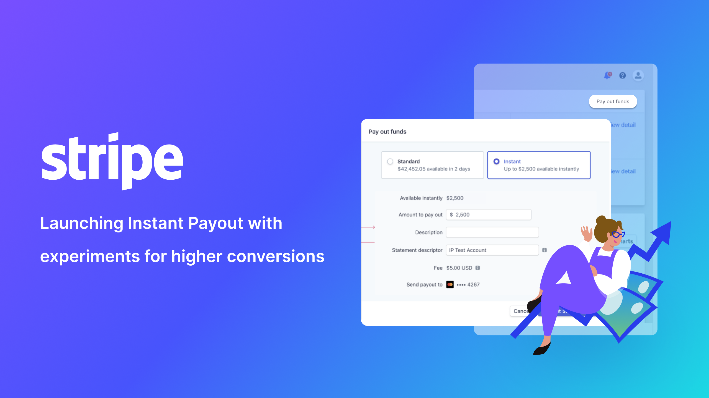
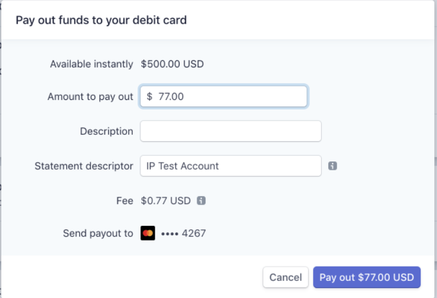
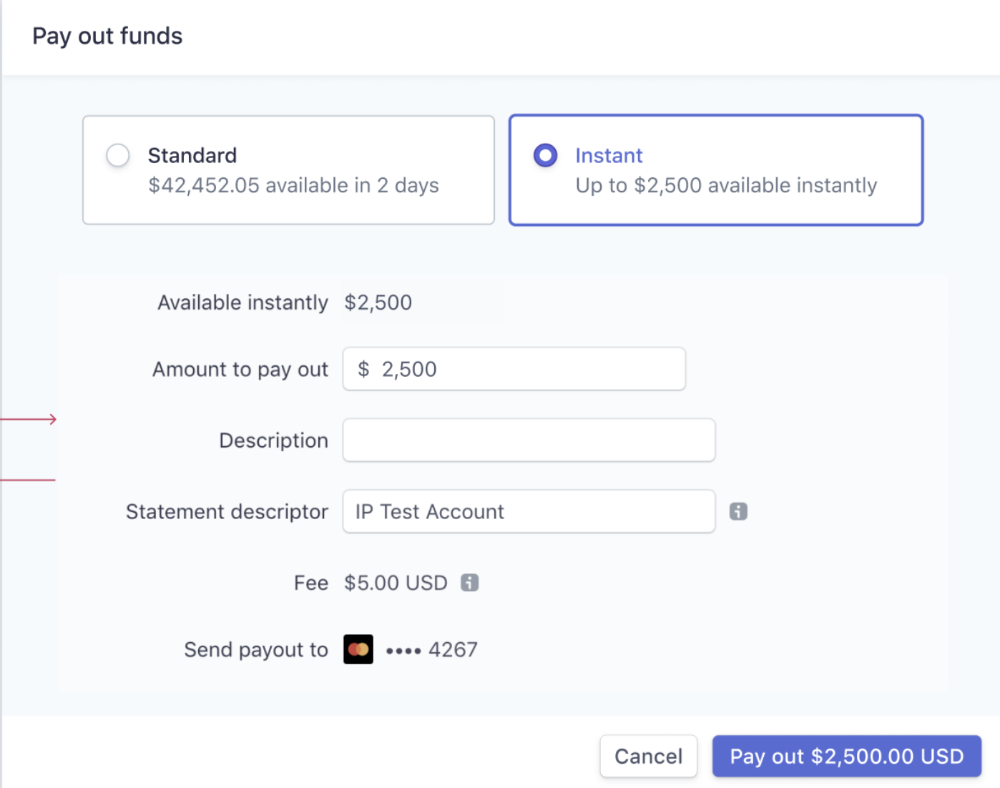
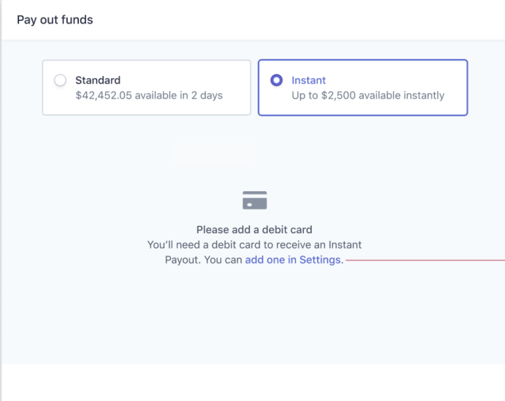
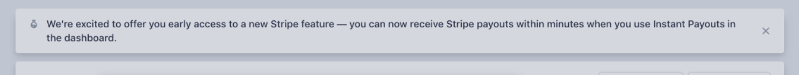
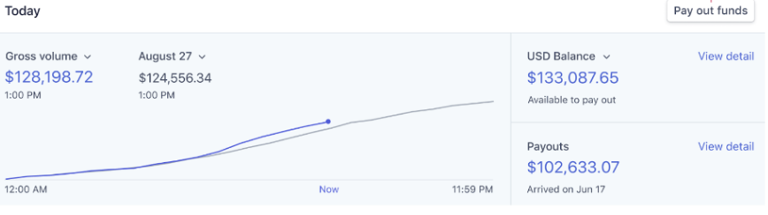
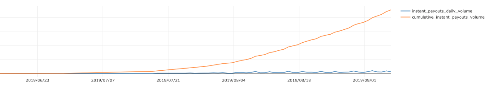

---
tags:
  - shipped
---

<figure markdown>
  { width="1000" }
</figure>

During my time at Stripe, I worked on launching the[ Instant Payout](https://stripe.com/docs/payouts/instant-payouts) product to millions of merchants. Although my focus was engineering, I worked cross-functionally and wore different hats including talking to users, coming up with design solutions, shipping and A/B testing. 

- :material-clock: **Timeline** 3 months
- :material-lightbulb-on: **Roles** Full Stack Engineering, Design, Research
- :material-hand-clap: **Team** 5 people from Stripe
- :material-toolbox: **Tools** React, Whimsical, Internal A/B testing framework

## 🧐 Problem Space

[Instant Payouts](https://stripe.com/docs/payouts/instant-payouts) was first launched to support [connected accounts](https://stripe.com/docs/connect/instant-payouts) on Stripe, who mainly use the product via APIs. With Instant Payouts, accounts were able to receive payouts faster -- within minutes rather than days. 

In 2019, our team led an effort to roll out the feature to a larger pool of eligible users. Different from the previous use cases, many of new targeted users use Stripe **dashboard** instead of the APIs.

## 🎯 Problem Statement

!!! question "How might we..."
   
    - integrate instant payout flow to the existing payout flow on the dashboard seamlessly? 
    - increase the adoption rate of instant payout?
    
## 🔦 UX Research & Design Process

My main role during this project was engineering. In hindsight, I realize I was also involved in the design process throughout this project. 

### Talking to users
We conducted a few zoom calls with potential and existing users with the goal to understand their experience with the product. During the calls, we identified users' eagerness to try out the new product and their concerns on the fees. We also learned that some users' were simply not aware of the new feasture

### Diagram the user flow 

We used [whimsical](https://whimsical.com/) to diagram the user flow and the major pain points. I worked with operation and design closely to map out how the existing product works and how might we make the new experience simple and seamless.

*Since Stripe has existing implementations for the UI components we need, we jumped straight to hi-fi and implementations instead of going through wireframe/ design process.*

## ✨ Final Solutions

### Payout modal V1 v.s V2
_Click on images for lightbox effect. Navigate using :arrow_left: :arrow_right:._

=== "V1"

	<figure markdown>
	{ width="2000" }
	</figure>  
=== "V2"
	<figure markdown>
	{ width="2000" }
	</figure>
     

!!! question "Constraints and considerations" 

	With the timing constraints and the complexity of the existing payout modal, we decided to create a new separate modal just for `Instant Payout`. The modal would open when user click on the `payout instantly`.

!!! note "Why did we choose the final solution." 
     After shipping V1, we decided to invest in engineering efforts to refactor and expand the existing `Standard Payout` modal. The main motivation is this being a prerequisite for [putting the button on the home page](#button-on-home-page). The refactor and redesign affords us the ability to integrate `Instant Payout` seamlessly into a existing payout modal. We were also able to show the **amount** and the **speed** of the different payout methods in a clear manner.

### Payout modal different paths

=== "Payout when debit card is available"

	<figure markdown>
	{ width="2000" }
	</figure>  
=== "Payout when debit card is not present"
	<figure markdown>
	{ width="2000" }
	</figure>
     

!!! question "Constraints and considerations" 

	- Adding a debit card requires multiple steps
	- Adding a debit card is usually done in the `Settings` page where users can also manage their bank accounts and other external accounts information.
!!! note "Why did we choose the final solution." 
	   Aware of the friction adding a debit card would introduce in the workflow, we considered embedding `adding a debit card` directly in the modal. However, after looking at our modal support and considering the existing pattern, we decided to choose the solution with a simple link to the `Settings` page.

### Notice for new feature 
<figure markdown>
  { width="1000" }
</figure>

!!! note "Notice with various copies" 
    During the alpha and beta rollout, we used various banner to introduce the feature to the users. For holiday weekend, we also have different copywritings. The change of copy and the notice resulted in bump in feature adoption.

### Button on home page
<figure markdown>
  { width="1000" }
</figure>
!!! note "Creating a button on dashboard home page" 
    To increase adoption and remind users to payout their funds, we later invested in placing a `Pay out funds` button on the dashboard `home` page. Although the button looks simple, it involved various refactoring and polishing of the modal. It also motivated the investment in the [redesign](#payout-modal-v1-vs-v2). 
!!! example "How did the boost go?"
    We used A/B testing framework and measure the conversion rate of the feature with and without the home button. During holiday weekend, we saw a 4x conversion rate. Overall, the button leads to a **0.09 percentage points** increase in conversion.

### Fee Discount
!!! note "First instant payout without fee" 
	To help first time users try out the product, we also introduced a concept called `coupon` and `fee discount`. Basically, when user try instant payout for the first time, we would waive the fee. The change mostly happened in the backend, but we made sure we communicated "how it works" with a tooltip on the dashboard.

## 📈 Impact
Shipping Instant Payout on dashboard was a success. While I can't recall the exact details or show the numbers, I believe we hit our goal of user adoption with improving features constantly and running multiple experiments.
<figure markdown>
  { width="1000" }
</figure>

## 💡 Key Learnings

???+ note "Experiment and be data-informed"

    During this project, I worked closely with data scientists and a team that provides the underlying A/B testing framework. Running experiments turn out to be powerful during new feature launch. We would set up experiments, opt in a small percentage of users and gather data comparing the control group. **The data-backed insights instead of our assumptions would inform us on the next steps with confidence**.

???+ note "Talk to users early and often"

    This project was done back in 2019 when I didn't really know the process of product design. We were able to hop on a few user calls faciliated by operations and design. The biggest lesson I learned is to talk to users early and often. **Every user interview revealed new insights and hearing how users appreciate our products motivated us to deliver a better experience**.

???+ note "Be aware of the underlying constraints"

    If you look at the UI changes for this project, there doesn't seem to be a lot. However, what makes it a huge cross-functional effort is the level of complexity under the hood - how to integrate with legacy frontend infrastructures, how to deliver a holistic experience on the home page. There are downsides and upsides adding feature to an existing ecosystem, and having a high level understanding of the system constraints helped us narrowing down to the feasible solutions quickly and effectively.

