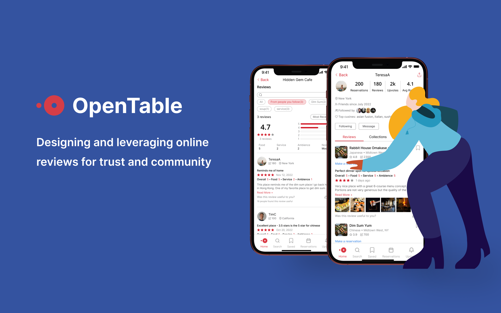

<figure markdown>
  { width="1000" }
</figure>

During my time at Stripe, I worked on launching the[ Instant Payout](https://stripe.com/docs/payouts/instant-payouts) product to millions of merchants. Although my focus was software engineering, I wore different hats including talking to users, coming up with design solutions, shipping and A/B testing. 

- :material-clock: **Timeline** 3 months
- :material-lightbulb-on: **Roles** Full Stack Engineering, Design, Research
- :material-hand-clap: **Team** 5 people from Stripe
- :material-toolbox: **Tools** React, Whimsical

## 🧐 Problem Statement
Instant Payout  - which allows merchants to receive their payouts within 30 minutes instead of days. 

## 🔦 UX Research

